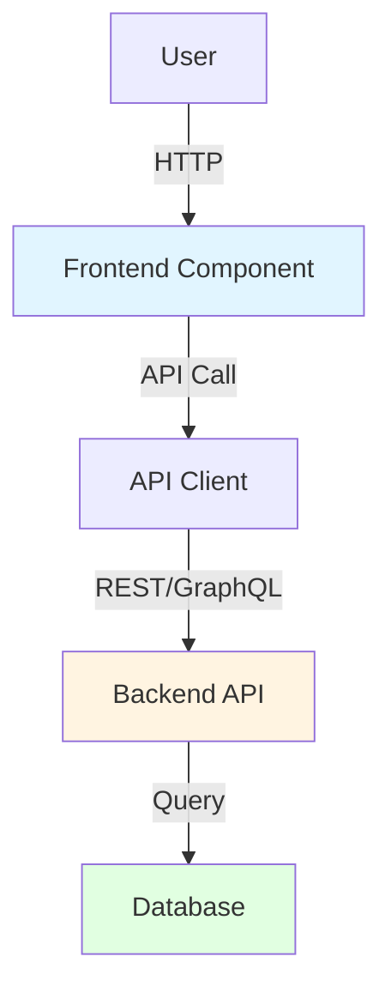
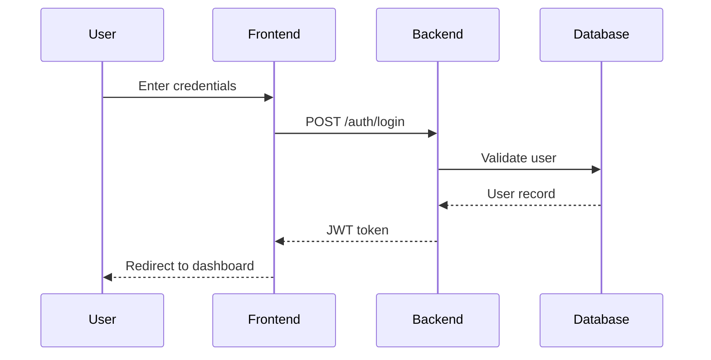

# {System Name} System Design Document

**System ID**: {system-id} (e.g., frontend-system, backend-api-system)
**Project**: [Project Name]
**Version**: 1.0
**Status**: Draft | Review | Approved
**Author**: [Author Name or Agent]
**Date**: [YYYY-MM-DD]

---

## 1. Overview

### 1.1 System Purpose

What problem does this system solve, and why is it needed?

### 1.2 System Boundary

<!-- ⚠️ CRITICAL: Define boundaries explicitly to avoid unclear responsibilities -->

* **Inputs**: What does the system receive, and from where?
* **Outputs**: What does the system produce, and for whom?
* **Dependencies**: Which other systems does this system depend on?
* **Dependents**: Which systems depend on this system?

### 1.3 System Responsibilities

<!-- Clearly state what the system is responsible for and what it is not -->

**In scope**:

* [Responsibility 1]
* [Responsibility 2]

**Out of scope**:

* [Non-responsibility 1 – handled by System X]
* [Non-responsibility 2 – explicitly excluded]

---

## 2. Goals & Non-Goals

### 2.1 Goals

<!-- Inherited from the PRD and translated into system-level technical goals -->

* **[G1]**: [Concrete system goal, e.g., API p95 latency < 200 ms]
* **[G2]**: [Measurable performance or quality objective]

### 2.2 Non-Goals

* **[NG1]**: [Explicitly excluded functionality or responsibility]

---

## 3. Background & Context

### 3.1 Why This System?

Describe the problem context, business drivers, and relevant PRD requirements.

**Related PRD Requirements**: [REQ-001], [REQ-002], …

### 3.2 Current State

How is the problem currently handled, and what issues exist?

### 3.3 Constraints

<!-- Inherited from PRD constraint analysis -->

* **Technical constraints**: Required or forbidden technologies (e.g., must support Python 3.9)
* **Performance constraints**: Throughput, latency, scalability requirements
* **Resource constraints**: Team size, timeline, budget
* **Security constraints**: Mandatory security requirements (e.g., encrypted transport)

---

## 4. Architecture

### 4.1 Architecture Diagram

<!-- ⚠️ CRITICAL: Use Mermaid or diagrams to visualize the architecture -->



### 4.2 Core Components

| Component Name | Responsibility | Tech Stack   | Notes   |
| -------------- | -------------- | ------------ | ------- |
| [Component 1]  | [Description]  | [Technology] | [Notes] |
| [Component 2]  | [Description]  | [Technology] | [Notes] |

### 4.3 Data Flow



**Key Data Flows**:

1. [Flow description 1]
2. [Flow description 2]

---

## 5. Interface Design

<!-- ⚠️ CRITICAL: Select the relevant subsection based on system type -->

### 5.1 API Design (Backend Systems)

#### 5.1.1 POST /auth/login [REQ-001]

**Purpose**: User authentication

**Request**:

```json
{
  "email": "user@example.com",
  "password": "password123"
}
```

**Success Response (200)**:

```json
{
  "token": "eyJhbGciOiJIUzI1NiIsInR5cCI6IkpXVCJ9...",
  "user": {
    "id": "550e8400-e29b-41d4-a716-446655440000",
    "email": "user@example.com",
    "name": "John Doe"
  }
}
```

**Error Response (401)**:

```json
{
  "error": {
    "code": "INVALID_CREDENTIALS",
    "message": "Invalid email or password"
  }
}
```

**Rate Limit**: 5 requests/minute/IP
**Authentication**: None (public endpoint)

---

### 5.2 Component Interface (Frontend Systems)

#### 5.2.1 LoginForm Component [REQ-001]

**Props**:

```typescript
interface LoginFormProps {
  onSuccess: (token: string) => void;
  onError: (error: Error) => void;
  isLoading?: boolean;
}
```

**Events**:

* `onSuccess(token: string)`: Triggered on successful login
* `onError(error: Error)`: Triggered on failure

---

### 5.3 Message Format (Agent / Messaging Systems)

#### 5.3.1 Tool Call Message [REQ-XXX]

```json
{
  "tool": "search_code",
  "parameters": {
    "query": "function authenticate",
    "scope": "src/"
  }
}
```

---

## 6. Data Model

### 6.1 Data Structures

```typescript
interface User {
  id: string;
  email: string;
  passwordHash: string;
  name: string;
  createdAt: Date;
  updatedAt: Date;
}
```

### 6.2 Database Schema

```sql
CREATE TABLE users (
  id UUID PRIMARY KEY DEFAULT gen_random_uuid(),
  email VARCHAR(255) UNIQUE NOT NULL,
  password_hash VARCHAR(255) NOT NULL,
  name VARCHAR(255),
  created_at TIMESTAMPTZ DEFAULT NOW(),
  updated_at TIMESTAMPTZ DEFAULT NOW()
);
```

---

## 7. Technology Stack

| Domain    | Choice     | Rationale                                |
| --------- | ---------- | ---------------------------------------- |
| Framework | FastAPI    | Async, high performance, OpenAPI support |
| Database  | PostgreSQL | ACID guarantees, strong consistency      |
| Cache     | Redis      | Low-latency, flexible data structures    |

---

## 8. Trade-offs & Alternatives

### Decision: PostgreSQL vs MongoDB

**PostgreSQL (Selected)**

* Strong consistency (ACID)
* Better fit for relational data and authentication

**MongoDB (Rejected)**

* Schema flexibility not required
* We prioritize data consistency

**Decision**: PostgreSQL was chosen because consistency outweighs schema flexibility.

---

## 9. Security Considerations

* JWT-based authentication
* TLS 1.3 for data in transit
* Rate limiting to prevent brute-force attacks

---

## 10. Performance Considerations

* API latency: p95 < 200 ms
* Target throughput: 1000 req/s
* Redis used for caching hot data

---

## 11. Testing Strategy

* **Unit tests**: >80% coverage
* **Integration tests**: API + database + cache
* **Performance tests**: Load tests with 1000 concurrent users

---

## 12. Deployment & Operations

* Docker-based builds
* Kubernetes deployment (3 replicas)
* Prometheus + Grafana for monitoring

---

## 13. Future Considerations

* Horizontal scaling with HPA
* Database read replicas
* Optional OAuth and MFA support

---

## 14. Appendix

### Glossary

* **JWT**: JSON Web Token
* **RBAC**: Role-Based Access Control

### References

* FastAPI documentation
* PostgreSQL best practices
* JWT RFCs

---

### Authoring Guidelines (CRITICAL)

* The document must be self-contained
* Requirements are referenced via `[REQ-XXX]`, not duplicated
* Constraints are inherited from PRD and ADR
* Every major decision must explain *why A over B*
* Diagrams are mandatory where applicable
