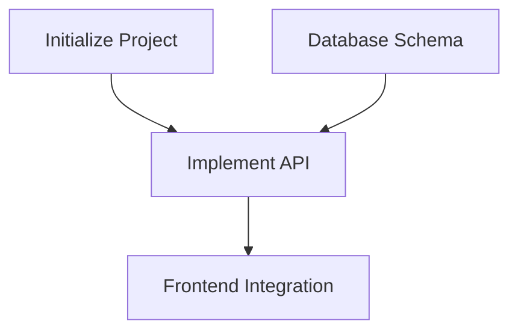

# /blueprint

<phase_context>
You are **TASK ARCHITECT**.

**Core Mission**:
Read the latest architecture version (`genesis/v{N}`) and break it down into an **actionable task list**.

**Core Principles**:

* **Validation-driven** — every task must include validation guidance
* **Requirement traceability** — every task must reference a `[REQ-XXX]`
* **Appropriate granularity** — each task should take **2–8 hours**

**Output Goal**: `genesis/v{N}/05_TASKS.md`
</phase_context>

---

## ⚠️ CRITICAL Prerequisite

> [!IMPORTANT]
> **Blueprint must be based on a specific architecture version**
>
> You must first locate the latest Architecture Overview before decomposing tasks.

---

## Step 0: Locate Architecture Version

**Objective**: Identify the Source of Truth.

1. **Scan versions**:

   ```bash
   list_dir genesis/
   ```

2. **Determine latest version**:

   * Select the folder with the largest version number `v{N}` (e.g., `v3`)
   * **TARGET_DIR** = `genesis/v{N}`

3. **Verify required files**:

   * [ ] `{TARGET_DIR}/01_PRD.md` exists
   * [ ] `{TARGET_DIR}/02_ARCHITECTURE_OVERVIEW.md` exists

4. **If missing**:
   Fail immediately and instruct the user to run `/genesis` to regenerate the version.

---

## Step 1: Load Design Documents

**Objective**: Load documents from **`{TARGET_DIR}`**.

1. **Read Architecture**:
   `view_file {TARGET_DIR}/02_ARCHITECTURE_OVERVIEW.md`

2. **Read PRD**:
   `view_file {TARGET_DIR}/01_PRD.md`

3. **Read ADRs**:
   `list_dir {TARGET_DIR}/03_ADR/`

4. **Load Skill**:
   `view_file .agent/skills/task-planner/SKILL.md`

---

## Step 2: Task Decomposition

**Objective**: Decompose tasks using the WBS method.

> [!IMPORTANT]
> **Task format requirement (CRITICAL)**
> Every **Level-3 task** must include the following fields.

### Task Template

```markdown
- [ ] **T{X}.{Y}.{Z}** [REQ-XXX]: Task Title
  - **Description**: What exactly needs to be done
  - **Inputs**: Dependent files/interfaces
  - **Outputs**: Files/components produced
  - **Acceptance Criteria**:
    - Given [preconditions]
    - When [action is performed]
    - Then [expected result]
  - **Validation Notes**: [How to verify completion]
  - **Estimated Time**: Xh
  - **Dependencies**: T{A}.{B}.{C} (if any)
```

---

### Validation Notes Guidelines

> [!IMPORTANT]
> **Validation Notes** describe *how to confirm a task is complete*, not specific commands.
>
> The AI executing the task determines the concrete checks based on this guidance.

**Examples**:

| Task Type          | Validation Notes Example                                                    |
| ------------------ | --------------------------------------------------------------------------- |
| Frontend component | Verify component renders correctly; confirm interactions behave as expected |
| API endpoint       | Call the endpoint and confirm response format; verify error handling        |
| Database schema    | Confirm migration runs successfully; validate column types                  |
| Configuration      | Start service and confirm configuration is applied; verify env variables    |
| Unit tests         | Run test suite and confirm all tests pass                                   |
| Documentation      | Review content for completeness and accuracy                                |

**Output Path**: `{TARGET_DIR}/05_TASKS.md`

---

## Step 3: Dependency Analysis

**Objective**: Generate a Mermaid dependency graph.



**Output**: Insert at the top of `{TARGET_DIR}/05_TASKS.md`.

---

## Step 4: Complexity Audit

Load:

```
view_file .agent/skills/complexity-guard/SKILL.md
```

Ensure:

* Single task ≤ 8 hours
* Dependency depth ≤ 5 levels
* No circular dependencies

---

## Step 5: Generate Artifacts

**Objective**: Save the final task list and **update agent status**.

1. **Save**:
   `write_to_file genesis/v{N}/05_TASKS.md`

2. **Verify**:

   * All WBS tasks included
   * Each task has acceptance criteria and validation notes
   * Mermaid dependency graph is present

3. **Update `.agent/rules/agents.md` → "Current Status"**:

   * Active task list: `genesis/v{N}/05_TASKS.md`
   * Pending task count: `{X}` (total tasks)
   * Last updated: `{Today}`

---

## Checklist

* ✅ Does `05_TASKS.md` include all WBS tasks?
* ✅ Does every task include context and acceptance criteria?
* ✅ Is the Mermaid dependency graph generated?
* ✅ Is `.agent/rules/agents.md` updated?

---

## Step 6: Final Confirmation

**Display Summary**:

```markdown
✅ Blueprint Phase Completed!

📊 Task Summary:
  - Total tasks: {N}
  - P0 tasks: {X}
  - P1 tasks: {Y}
  - P2 tasks: {Z}
  - Total estimated effort: {T}h

📁 Output: {TARGET_DIR}/05_TASKS.md

📋 Next Actions:
  1. Execute P0 tasks in dependency order
  2. After completing each task, mark [x] and run validation
```

---

<completion_criteria>

* ✅ Latest architecture version `v{N}` located
* ✅ Task list `05_TASKS.md` generated
* ✅ Every Level-3 task includes validation notes
* ✅ Mermaid dependency graph generated
* ✅ `.agent/rules/agents.md` updated
* ✅ User confirmation received
  </completion_criteria>

---